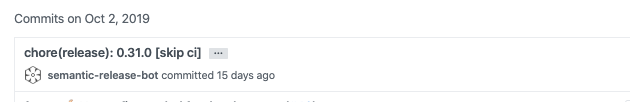

This guide should help you setup from scratch or understand how the CI for [client](https://github.com/egendata/client) is configured

## Automating things with Travis and semantic-release

- This project is meant to be used as an NPM package, as so we automate the process of publishing to NPM

- We use [Travis CI](https://travis-ci.com/) to build, test and deploy. It is free as long as the project you build is open source

- The way Travis CI works is that everytime your repository is updated (new branch, new commit, new tag) it picks up that branch and will run the specified tasks from your configuration

- We use [semantic-release](https://github.com/semantic-release/semantic-release) for automating the package release workflow based on the commit messages

- The [Travis configuration](https://github.com/egendata/client/blob/master/.travis.yml) is rather simple and consists of 2 stages (`lint-and-test` and `publish`)

  - `lint-and-test` stage runs for every branch (except `master`) and it will install npm dependencies, run lint and unit tests; This is a good tool that assists you when you review a pull-request as you can see that tests are failing or passing

  - `publish` stage runs only on the `master` branch and it runs `semantic-release`

- We also set several environment variable [inside Travis](https://travis-ci.com/egendata/client/settings):

  - `GITHUB_TOKEN` is used for push back to Github a new release, update CHANGELOG (it needs to have write access to the repository)

  - `NPM_TOKEN` is used for publishing to NPM

- For `semantic-release` we have the following dev dependencies (plugins) installed at the time of writing this (`semantic-release` comes with a set of plugins included and some we install and explain further down):

  ```json
  "@semantic-release/changelog": "^3.0.4",
  "@semantic-release/git": "^7.0.16",
  "semantic-release": "^15.13.24",
  ```

- We mostly use [semantic-release plugins](https://semantic-release.gitbook.io/semantic-release/extending/plugins-list) with the default configuration and the pipeline for it looks as follows as defined in the [.releaserc.json](https://github.com/egendata/client/blob/master/.releaserc.json)

  ```json
  {
    "plugins": [
      "@semantic-release/commit-analyzer",
      "@semantic-release/release-notes-generator",
      "@semantic-release/changelog",
      "@semantic-release/npm",
      "@semantic-release/github",
      "@semantic-release/git"
    ]
  }
  ```

- Now let's dive deeper into each plugin and what and why we do things in this way:

  - `@semantic-release/commit-analyzer` is the one that analyzes commits since the last release and determines if a new and what type of release should be made; It is going to retrieve the latest Git tag from the Github repo and go through the commits made since that tag and determine if a new release should be made (that is if `fix:` or `feat:` commits are present)

  - **!!! IMPORTANT NOTICE: If you add `semantic-release` to a new project and don't want your first release to bump directly to 1.0.0 you should manually create a git tag like `git tag v0.0.0` in case you have initialized your repo version with 0.0.0 in the `package.json` and push the tag to remote before running `semantic-release`. This will make so that it determines the next version based on 0.0.0 !!!**

  - `@semantic-release/release-notes-generator` is the one that makes the release notes look nice like this:

    

  - `@semantic-release/changelog` is the module that creates and updates the [CHANGELOG](https://github.com/egendata/client/blob/master/CHANGELOG.md)

  - `@semantic-release/npm` is used to publish to NPM.

  - **!!! IMPORTANT NOTICE: If you are setting this up for a new project that should be [scoped to @egendata](https://www.npmjs.com/settings/egendata/packages) you need this following part inside your `package.json` to be able to create the package !!!**

    ```json
    "publishConfig": {
      "access": "public"
    },
    ```

  - `@semantic-release/github` is the one that pushes the new tag and release notes back to Github and needs the `GITHUB_TOKEN` environment variable set in Travis

  - `@semantic-release/git` is an extra plugin that we added because we want to commit and push back to Github the updated `CHANGELOG.md` and `package.json`. Without this module the `package.json` is never pushed back to Github, this isn't a problem since `semantic-release` determines the next version based on existing Git tags but it's nice to have it updated. It uses the default configuration and commits with `chore:` which will not trigger a new release.

    
