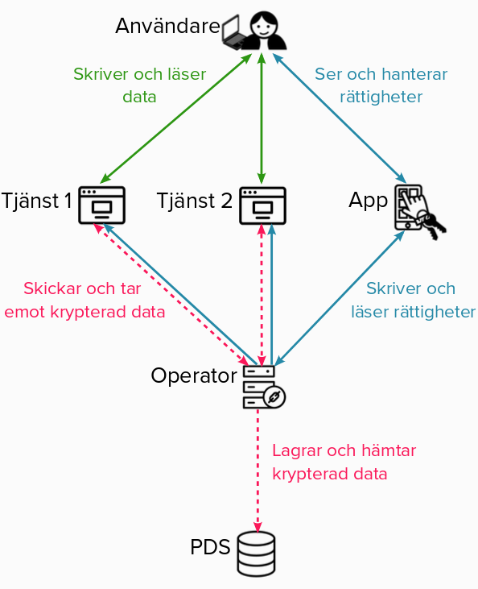

# Så fungerar Egendatas infrastruktur

# Komponenter

### [Tjänst](services)
En sajt eller applikation som använder sig av Egendata för att hantera persondata. Klientbibliotektet Client är till för att göra det enkelt för tjänster att implementera Egendata.

För mer detaljer om hur en tjänst fungerar och hur du sätter upp en, se [tjänster](services).

### [App](app)
En mobilapplikation med vilken användaren kontrollerar rättigheterna till sin data. Tekniskt sett är det Appen som representerar användaren gentemot resten av infrastrukturen.

När användaren skapar ett konto genereras användarens kryptografiska nycklar i Appen; den privata delen av nyckeln lämnar sedan aldrig Appen och används för att bevisa att det är användaren som står bakom de kommandon användaren skickar till andra delar av infrastrukturen (exempelvis ändring i rättigheter).

### [Operator](operator)
Operatorn agerar knytpunkt i Egendata-nätverket; den slussar meddelanden mellan användare (App) och tjänster samt krypterad data mellan tjänster och lagringsutrymme (PDS). 

Operatorn måste vara tillgänglig för att nätverket ska gå att använda. En viktig detalj är att operatorn inte har någon möjlighet att läsa eller ändra i data eller rättigheter. Dessa är krypterade och/eller signerade så att en operator som missköter sig inte kan komma över någon persondata.

### PDS (Personal Data Store)
En lagringsyta där användarens krypterade persondata lagras och läses av Operator. Kan vara vilken typ av lagring som helst som Operator stödjer. Användaren har möjlighet att välja var hens data lagras genom att välja PDS i Appen.

# Exempel på användningsflöde
Användaren:
* Installerar Egendata-Appen på sin telefon, skapar ett konto och väljer var dess data ska lagras (vilken PDS).
* Besöker en tjänst som använder Egendata, klickar på "Logga in" och blir presenterad med en QR-kod
* Skannar QR-koden med Appen och får då frågan om hen vill registrera sig
* Användaren blir presenterad med beskrivning av den data tjänsten vill läsa eller skriva och varför
* Om användaren godkänner detta då händer det grejer
